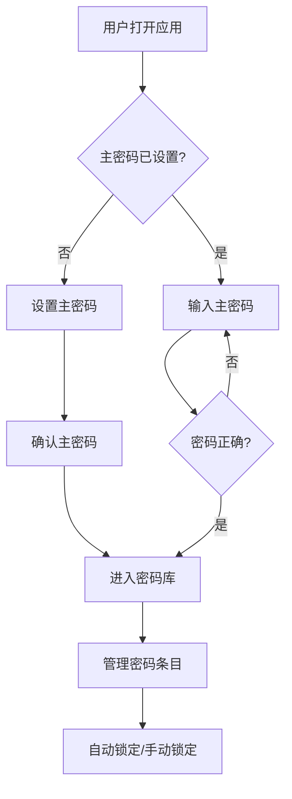

## 1. 产品概述

个人密码管理器是一个纯前端 Web 应用，所有数据在浏览器本地加密存储，无需后端服务器。用户通过主密码解锁密码库，安全地管理各类账户密码。

- **目标用户**：需要安全管理多个账户密码的个人用户
- **核心价值**：零后端成本、数据完全自主可控、可部署到 GitHub Pages 免费托管
- **安全理念**：AES-256 加密存储，主密码不落盘，所有加解密在浏览器完成

## 2. 核心功能

### 2.1 功能模块

| 模块名称 | 核心功能 |
|---------|---------|
| 主密码锁屏 | 首次设置主密码、后续验证解锁、支持记住会话 |
| 密码库管理 | 增删改查密码条目、分类管理、搜索过滤 |
| 密码生成器 | 自定义长度、字符类型、强度指示、一键生成 |
| 数据导入导出 | 加密 JSON 导出、导入恢复、明文 CSV 导出 |
| 安全仪表盘 | 密码强度统计、弱密码检测、重复密码提醒 |

### 2.2 页面详情

| 页面名称 | 模块名称 | 功能描述 |
|---------|---------|---------|
| 锁屏页 | 主密码输入 | 首次设置或验证主密码，支持显示/隐藏密码 |
| 主界面 | 顶部导航栏 | 搜索框、新建按钮、设置入口 |
| 主界面 | 密码列表 | 卡片式展示，显示标题/用户名，点击查看详情 |
| 主界面 | 密码详情抽屉 | 显示完整信息、复制按钮、编辑/删除操作 |
| 主界面 | 新增/编辑弹窗 | 表单填写标题、用户名、密码、URL、备注、分类 |
| 密码生成器 | 生成器面板 | 长度滑块、字符选项、强度指示、历史记录 |
| 设置页 | 数据管理 | 导入导出、清除数据、自动锁定时间设置 |

## 3. 核心流程

### 3.1 首次使用流程

用户打开应用 → 检测无主密码 → 引导设置主密码 → 确认主密码 → 进入空密码库 → 开始添加密码

### 3.2 日常使用流程

用户打开应用 → 输入主密码解锁 → 查看/搜索/管理密码 → 操作完成 → 自动锁定或手动锁定

## 4. 用户界面设计

### 4.1 设计风格

- **主题**：深色赛博朋克风"数字保险库"美学，传达安全与科技感
- **主色调**：深蓝黑底色 (#0a0e1a) + 青色霓虹强调 (#00f0ff) + 紫色辅助 (#a855f7)
- **字体**：标题用 JetBrains Mono（等宽科技感），正文用 Outfit（现代圆润）
- **布局**：左侧固定侧边栏 + 右侧主内容区，卡片式列表
- **图标**：Lucide React 图标库，线性风格
- **动效**：解锁动画、卡片悬浮、霓虹辉光、扫描线效果

### 4.2 页面设计概览

| 页面名称 | 模块名称 | UI 元素 |
|---------|---------|---------|
| 锁屏页 | 中央卡片 | 毛玻璃背景、霓虹边框、锁图标动画、密码输入框 |
| 主界面 | 侧边栏 | 分类导航、Logo、锁定按钮，半透明深色 |
| 主界面 | 密码列表 | 卡片网格/列表切换、悬浮辉光、分类标签 |
| 详情抽屉 | 信息展示 | 等宽字体显示密码、复制按钮带反馈、编辑表单 |
| 生成器 | 控制面板 | 滑块、开关按钮、强度条颜色渐变、大号密码显示 |

### 4.3 响应式设计

- 桌面端优先（1280px+）：完整三栏布局
- 平板（768px-1280px）：侧边栏可折叠
- 移动端（<768px）：底部导航、单列卡片、全屏抽屉
