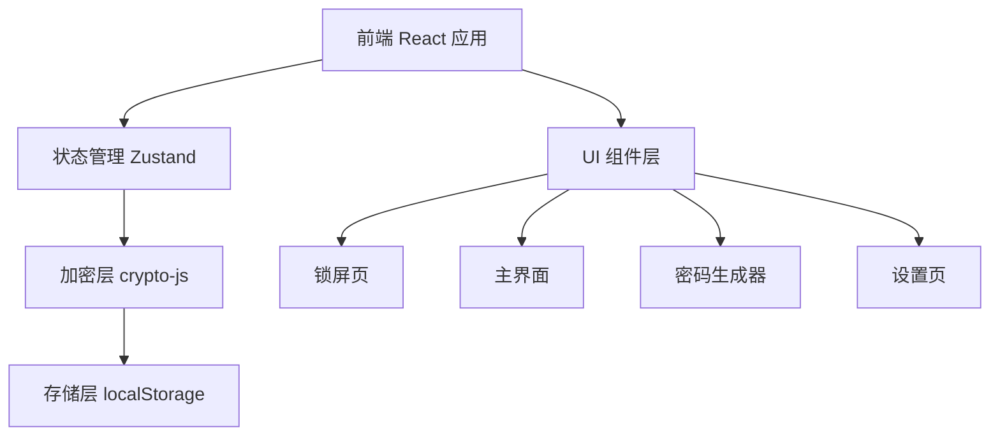
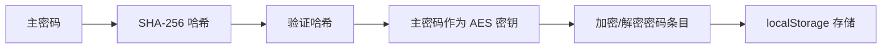

## 1. 架构设计

纯前端架构，所有逻辑在浏览器执行，数据加密后存储于 localStorage。



## 2. 技术说明

- **前端框架**：React@18 + TypeScript + Vite
- **初始化工具**：vite-init (react-ts 模板)
- **样式方案**：TailwindCSS@3
- **状态管理**：Zustand
- **路由**：React Router DOM
- **加密库**：crypto-js (AES-256-CBC)
- **图标库**：lucide-react
- **后端**：无（纯前端应用）
- **数据库**：无（使用浏览器 localStorage）

## 3. 路由定义

| 路由 | 用途 |
|------|------|
| `/` | 锁屏页（主密码设置/验证） |
| `/vault` | 密码库主界面（列表+搜索+详情） |
| `/generator` | 密码生成器 |
| `/settings` | 设置页（导入导出、安全选项） |

## 4. 数据模型

### 4.1 数据结构定义

```typescript
// 密码条目
interface PasswordEntry {
  id: string;
  title: string;
  username: string;
  password: string;
  url?: string;
  notes?: string;
  category: string;
  createdAt: number;
  updatedAt: number;
}

// 应用状态
interface VaultState {
  entries: PasswordEntry[];
  categories: string[];
  isLocked: boolean;
  isInitialized: boolean;
}
```

### 4.2 存储方案

- `vault_master_hash`：主密码的 SHA-256 哈希（用于验证）
- `vault_encrypted_data`：AES 加密后的密码条目 JSON
- `vault_settings`：非敏感设置（自动锁定时间等）

### 4.3 加密流程



## 5. 部署方案

- **GitHub Pages**：通过 `gh-pages` 分支部署
- **构建命令**：`npm run build`
- **部署命令**：`npm run deploy`
- **base 路径**：配置 vite.config.ts 的 base 为仓库名
